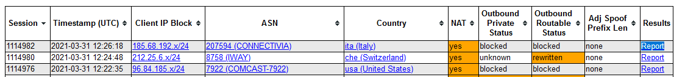

# 
## Security Questions
- Explain the idea of ip spoofing

The idea is to change in the source IP in the IP header and to pretend to be an other device.

- Is this a realistic attack over the internet with TCP/IP - explain

    This attack will probably fail when the attacker want a longer conversation with the server. This means if attacker want to make a request from a foreign service to execute a command, this will fail because the connection needs SYN, SYN+ACK and ACK to establish a connection. To impersonate a device the setup would need injection in the routing table(Route injection)

    The only possible attacks could be:
    - SYN Flooding
    - RST Flooding
    - FIN Flooding
    - Flag Rainbow Flooding

- Is this a realistic attack over the internet with UDP/IP - explain
    This protocol don't need a Handshake before the main connection can start, this way a UDP service directly process the incoming traffic.
    Possible attack vectors could be:
    - DNS
    - FTP control and connection
    - WINS
    - Xerox protocols
    - NetBIOS
    - Kerberos
    - DHCP

- What are the destination addresses of the spoofer tool (see in Wireshark)
    **SRC:**
    - 169.254.78.9
    - 192.168.239.2
    - 51.15.43.110
    - 192.172.226.242
    - 6.1.2.3

   **DST:**
    - 239.255.255.250
    - 192.168.239.132
    - 128.232.97.9
    - 205.189.33.78
    - 138.44.13.110
    - 139.18.1.244
    - 128.223.157.13
    - 204.235.64.14
    - 192.172.226.242
    - 192.172.226.247
    - 193.1.33.5
    - 192.107.171.130
    - 78.41.116.2
    - 130.206.158.142
    - 203.181.248.51
    - 192.42.115.98
    - 192.172.226.243

- What protocol is the spoofer tool trying to spoof?
    **Protocol:**
    - SSDP
    - DNS
    - TCP
    - TLSv1.2
    - TLSv1.3
    - ICMP

- Do you find your own results on https://spoofer.caida.org/recent_tests.php
    