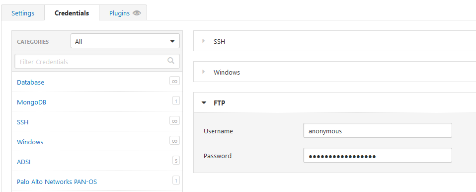
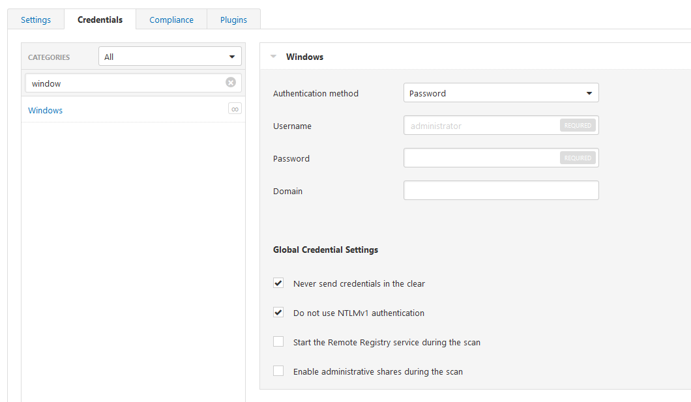

# 07 - Nessus Vulnerability Scanner
## Security Questions
1. describe how you would configure a username and password when testing an ftp service?
    There is a option in the credentials section of the scan settings. 
    
2. describe how you would configure a domain when testing an Active Directory
    There is a option in the credentials section of the scan settings.
    
3. describe how you would configure the portscan prior the vulnerability scan   
    I would scan the from 0 to 49151 for a single host, enable UDP Scan, Scan Network Printers and Novell Netware Hosts.

4. is is possible to run a brute-force attack against an ssh service?
    Yes, there is a Plugin Hydra that provide provides more option for the scans. 
    https://docs.tenable.com/tenablesc/5_8/Content/CustomScanPolicyOptions.htm?Highlight=hash#Brute